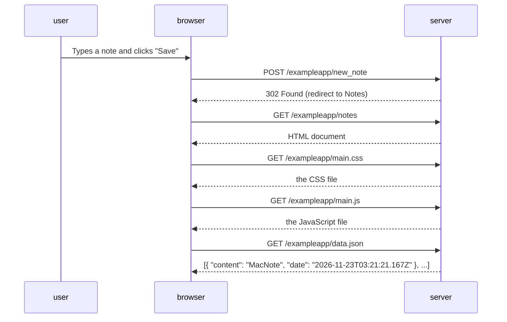

```mermaid
sequenceDiagram
        participant user
        participant browser
        participant server
        user->>browser: Types a note and clicks "Save"
        browser->>server: POST /exampleapp/new_note
        server-->>browser: 302 Found (redirect to Notes)
        browser->>server: GET /exampleapp/notes
        server-->>browser: HTML document
        browser->>server: GET /exampleapp/main.css
        server-->>browser: the CSS file
        browser->>server: GET /exampleapp/main.js
        server-->>browser: the JavaScript file
        browser->>server: GET /exampleapp/data.json
        server-->>browser: [{ "content": "MacNote", "date": "2026-11-23T03:21:21.167Z" }, ...]
```
