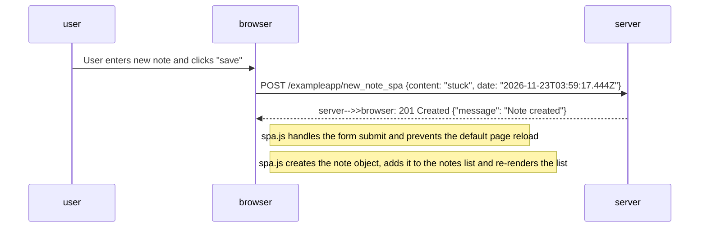

```mermaid
sequenceDiagram
        participant user
        participant browser
        participant server
        user->>browser: User enters new note and clicks "save"
        browser->>server: POST /exampleapp/new_note_spa {content: "stuck", date: "2026-11-23T03:59:17.444Z"}
        server-->>browser:         server-->>browser: 201 Created {"message": "Note created"}
        Note right of browser: spa.js handles the form submit and prevents the default page reload
        Note right of browser: spa.js creates the note object, adds it to the notes list and re-renders the list
```
